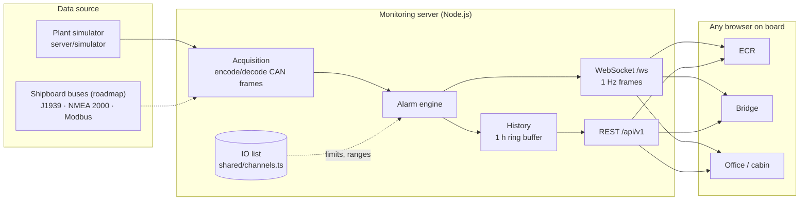

# AEGIS-MONITOR — engine room monitoring and alarm system


**Русская версия: [README.ru.md](README.ru.md)** — with the full story of what this is, why it
is built this way and what changed in 0.2.


A web-based monitoring layer for a ship's machinery: it collects engine-room data from the
buses the ship already has, evaluates alarms in one place, keeps history, and shows the
whole plant on any screen on board — engine control room, bridge, chief engineer's office.

Until it is connected to real hardware it runs against a **physical model of the engine room**
of a 28,000 dwt cargo ship on passage from Rotterdam to Gothenburg. The model is not random
noise: power follows the propeller law, fuel follows an SFOC curve, temperatures lag their
heat balance, the power management system starts generators, the autopilot steers along a
passage plan. Eight real failure modes can be injected, and the alarms appear exactly as they
would on watch.

> Written by a marine engineer. This is a secondary, read-only monitoring tool. It is not a
> class-approved alarm and monitoring system and must not replace the one required by SOLAS
> Chapter II-1. See [Standards and scope](#standards-and-scope).

---

## Contents

- [What it does](#what-it-does)
- [Quick start](#quick-start)
- [A five-minute demo](#a-five-minute-demo)
- [Architecture](#architecture)
- [The alarm model](#the-alarm-model)
- [The plant simulator](#the-plant-simulator)
- [API](#api)
- [Project structure](#project-structure)
- [Testing](#testing)
- [Deployment](#deployment)
- [Standards and scope](#standards-and-scope)
- [Roadmap](#roadmap)
- [Author](#author)

---

## What it does

| | |
|---|---|
| **70 monitored points, 7 systems** | Main engine, generators and switchboard, fuel treatment, cooling water, steering gear, HVAC, ballast and stability. Every point is defined once in the [IO list](docs/io-list.md) with its range, alarm limits, bus address and the reason it is watched. |
| **Server-side alarm engine** | H/HH and L/LL limits, 2 s on-delay, hysteresis, alarm blocking for stopped machinery, sensor-fault detection, NEW → ACK → RTN lifecycle. One alarm list for every screen; an acknowledgement on the bridge is seen in the ECR. |
| **Real fieldbus path** | Generator data travels as SAE J1939 frames (EEC1, ET1, EFL/P1), rudder and temperatures as NMEA 2000 frames (127245, 130312), and is decoded by the same codecs a gateway on a real CAN bus would use — with real bus resolution. |
| **Live dashboard** | Gauges with alarm zones, status lamps, trends with limit lines, exhaust temperature balance, a 3D section of the machinery spaces coloured by system state, audible alarm, stale-data detection. |
| **Voyage and efficiency** | Passage plan plot, ETA, SFOC, fuel per day, fuel burned this voyage and fuel on board at arrival. |
| **History** | One hour kept on the server at 1 Hz and pre-filled at start, so trends are full the moment you open the page and are refilled after a lost connection. |
| **Fault injection** | Eight scenarios, from a clogging lube oil filter to a generator trip with PMS load shedding and standby start. |

| Machinery | Generators after a trip |
|---|---|
|  |  |
| **Alarms and event log** | **Voyage** |
|  |  |

---

## Quick start

Requirements: Node.js 22+, npm 10+.

```bash
git clone https://github.com/hermandoronin/AEGIS-MONITOR.git
cd AEGIS-MONITOR
npm install
npm start        # monitoring server on :3001 and dashboard on :5173
```

Open **http://localhost:5173**. The Vite dev server proxies `/api` and `/ws` to the monitoring
server, so nothing needs configuring.

| Command | What it does |
|---|---|
| `npm start` | Server and dashboard together |
| `npm run server` / `npm run dev` | Each on its own |
| `npm test` | Unit tests (vitest) |
| `npm run build` | Type-check everything and build the dashboard into `dist/` |
| `npm run lint` | ESLint |
| `npm run docs:io-list` | Regenerate [docs/io-list.md](docs/io-list.md) from the code |

Server settings (all optional, see [.env.example](.env.example)): `PORT`, `SIM_SEED` (fixed seed
= repeatable run), `BACKFILL_S` (history pre-generated at start), `TICK_MS`.

---

## A five-minute demo

1. **Overview** — every system green, key figures along the top, the ship on passage.
2. **Simulator → Generator shutdown → Inject.** Open *Generators*: DG1 trips, DG2 is overloaded
   to ~110%, bus frequency dips below 58 Hz, after 4 s the PMS trips non-essential consumers,
   after 18 s DG3 is on line and sharing load, 30 s later the consumers are reconnected.
3. **Alarms** — the whole sequence is there: the frequency and overload alarms already
   returned to normal (RTN) but still wait for acknowledgement; the event log shows how long
   each lasted.
4. **Simulator → Cylinder 4 injector fault.** On *Main Engine* the exhaust balance shows
   cylinder 4 drifting away from the mean, then the high and high-high alarms, while SFOC
   creeps up on the Voyage tab.
5. **Sea water pressure transmitter wire break** — note that you get a *sensor fault* caution,
   not a false low-pressure alarm.
6. **Reset all faults.**

---

## Architecture



One tick, once per second (`server/runtime.ts`):

1. **Plant** produces physical readings for every tag.
2. **Acquisition** encodes the J1939 and NMEA 2000 points into CAN frames and decodes them back
   (Modbus and 4-20 mA points pass straight through — the simulator plays the PLC).
3. Values are rounded to their display resolution, so what alarms is exactly what is shown.
4. **Alarm engine** evaluates every limit.
5. **History** stores the row; the **frame** (values, system states, alarm list, voyage) goes
   to every WebSocket client.

Design choices, briefly:

- **The IO list is code** (`shared/channels.ts`). The simulator, the decoders, the alarm engine,
  the dashboard layout and the documentation all read the same table, and tests check it for
  consistency. Adding a sensor is adding one row.
- **Shared types** (`shared/types.ts`) for everything on the wire — the server and the browser
  cannot drift apart.
- **Alarms on the server**, not in the browser: one truth for all screens, acknowledgements
  propagate, a page reload does not lose alarms.
- **Same-origin by default**: the browser only talks to its own host; Vite (dev) and nginx
  (Docker) proxy `/api` and `/ws`. Works under any IP or host name on the ship's LAN.
- **Seeded simulator**: a fixed `SIM_SEED` gives the same run every time, for tests and demos.

---

## The alarm model

Each limit of each point is its own **alarm point** (`ME.LO.PRESS:warning`,
`ME.LO.PRESS:critical`, `DG1.TRIP:state`, `SW.PRESS:fault`).

| Rule | Behaviour |
|---|---|
| On-delay | A condition must hold for 2 s before the alarm is raised — no chatter from spikes. |
| Hysteresis | Clears only 1% of span inside the limit — a value sitting on a limit does not flap. |
| Alarm blocking | Points with `inhibitedBy` are silent while that machine is stopped (a standby generator has zero oil pressure, and that is fine). |
| Sensor fault | A reading more than 10% of span outside the instrument range (e.g. a 4-20 mA wire break reads −25%) raises a *Caution* and suppresses the process alarms of that point. |
| Lifecycle | **NEW** (active, unacknowledged, flashing) → **ACK** (active, steady) → gone when cleared. If it clears first it stays as **RTN** until acknowledged. |
| Priorities | Critical ≈ IEC 62923 *alarm*, Warning ≈ *warning*, Caution ≈ *caution*. |

---

## The plant simulator

`server/simulator/plant.ts` — a set of coupled first-order models, integrated at 1 s:

- **Main engine**: 6-cylinder two-stroke, MCR 8,000 kW at 120 rpm, sea passage at 78% MCR.
  Speed from the propeller law, wave-induced torque (the governor holds speed, the fuel index
  moves), SFOC curve with its minimum near 78% load, thermal lags for jacket water, lube oil,
  scavenge air, thrust bearing and each cylinder's exhaust.
- **Power plant**: 3 × 1,000 kWe gensets, hotel load wandering around 1,060 kW with a cycling
  compressor, PMS with standby start (on trip or >90% load), preferential trip after 4 s of
  overload, reconnection when there is margin, frequency dip on a load step.
- **Fuel**: viscosity-controlled heater, service tank, fuel burned and remaining on board.
- **Navigation**: rhumb-line passage plan, PID autopilot with a first-order (Nomoto) yaw model,
  wind and wave disturbance, speed from propeller pitch and slip, tidal current.
- **Ballast/stability**: tank levels, list from the transverse moment, roll.

With no fault injected it runs for hours without a single alarm (a test checks an hour on three
seeds). Scenarios:

| Scenario | What you should see |
|---|---|
| ME lube oil filter clogging | LO inlet pressure low after ~70 s, low-low after ~110 s |
| HT cooling water thermostat stuck | HT outlet high after ~110 s, high-high after ~160 s |
| Cylinder 4 injector fault | Cyl 4 exhaust high / high-high, SFOC rises |
| Generator shutdown | Trip, overload, frequency dip, load shedding, standby start |
| Fuel heater failure | Viscosity high after ~70 s, high-high after ~130 s |
| Steering gear hydraulic leak | Tank level low / low-low (SOLAS II-1/29) |
| Ballast valve passing | DB 1 stbd floods, list above 5° |
| SW pressure transmitter wire break | Sensor-fault caution, no false process alarm |

---

## API

Base path `/api/v1`. Vessel id of the demo ship: `aegis-001`.

| Method | Path | Returns |
|---|---|---|
| GET | `/health` | Status, uptime, time of last frame |
| GET | `/vessels` | Vessels served by this server |
| GET | `/vessels/:id` | Particulars (`VesselInfo`) |
| GET | `/vessels/:id/channels` | The IO list |
| GET | `/vessels/:id/status` | Latest frame (`TelemetryFrame`) |
| GET | `/vessels/:id/history?seconds=900&tags=A,B` | `{ tags, rows: [[t, v1, v2…]] }`, up to 3600 s |
| GET | `/vessels/:id/alarms?limit=200` | Alarm event log, newest first |
| POST | `/vessels/:id/alarms/:alarmId/ack` | Acknowledge one alarm |
| POST | `/vessels/:id/alarms/ack-all` | Acknowledge all |
| GET | `/sim/scenarios` | Fault scenarios and whether they are active |
| POST | `/sim/scenarios/:id/start` · `/stop` | Inject / remove a fault |
| POST | `/sim/reset` | Clear all faults, machinery back to normal |

**WebSocket** `/ws`: on connect the latest `TelemetryFrame`, then one per tick. All types are in
[`shared/types.ts`](shared/types.ts).

---

## Project structure

```
shared/                      Code used by both server and dashboard
  types.ts                   Everything that crosses the wire
  channels.ts                IO list: 70 points, ranges, limits, addresses, descriptions
  vessel.ts                  Demo vessel particulars (fictional ship)
server/
  index.ts                   Entry point: tick loop, WebSocket broadcast, shutdown
  runtime.ts                 One tick: plant -> fieldbus -> alarms -> history -> frame
  api.ts                     REST routes
  alarms.ts                  Alarm engine
  history.ts                 In-memory history ring buffer
  acquisition/fieldbus.ts    Encode/decode J1939 and NMEA 2000 frames into tags
  protocols/j1939.ts         SAE J1939 codec (EEC1, ET1, EFL/P1)
  protocols/nmea2000.ts      NMEA 2000 codec (127245, 127488, 130312)
  simulator/plant.ts         Engine-room physics
  simulator/scenarios.ts     Fault scenarios
  simulator/route.ts         Passage plan and plane-sailing maths
  simulator/random.ts        Seeded noise, lags, random walks
  **/*.test.ts               Unit tests next to the code they test
src/                         Dashboard (React 19, Vite, Tailwind 4)
  App.tsx                    Layout and tab switching
  config.ts                  URLs and timing constants
  api/client.ts              Typed REST client
  hooks/                     WebSocket, telemetry wiring, alarm actions and sound, clock
  store/useVesselStore.ts    Zustand store: frame, history, alarms, navigation
  views/                     Overview, Machinery, Voyage, Alarms, Simulator
  components/                Gauge, trend, alarm list, 3D section, header, sidebar
  utils/                     Formatting, limit colouring
scripts/gen-io-list.ts       Writes docs/io-list.md from shared/channels.ts
deploy/nginx.conf            Serves the dashboard, proxies /api and /ws
docs/                        IO list and screenshots
```

---

## Testing

```bash
npm test
```

58 tests covering the J1939 and NMEA 2000 codecs (hand-built frames, round trips,
not-available values, PDU1 addressing), the fieldbus path, every alarm rule, the history buffer,
the IO list's internal consistency, the REST API end to end, and the simulator: an hour of
normal passage without an alarm on three seeds, repeatability, and each fault scenario raising
the alarms it should. CI runs lint, tests, type-check and build on every push and pull request.

---

## Deployment

```bash
docker compose up --build                                  # http://localhost:8080
docker compose -f docker-compose.prod.yml up -d --build    # port 80, restarts on its own
```

| Service | Image | Role |
|---|---|---|
| `frontend` | `Dockerfile` → nginx | Built dashboard; proxies `/api` and `/ws` to `backend` |
| `backend` | `Dockerfile.server` → Node 22 | Monitoring server; production dependencies only, runs as `node`, health check |

A fanless industrial PC is plenty for the server. Any modern browser works as a display;
Chromium-based ones give the best WebGL performance for the 3D view.

---

## Standards and scope

This is a hobby project by a working marine engineer. It claims no compliance with anything.
The references that shaped it:

- **IEC 62923-1/-2** (bridge alert management) — priorities, the acknowledge/rectified model.
  Implemented: three priorities, unacknowledged/acknowledged/rectified-unacknowledged states.
  Not implemented: escalation, silence, responsibility transfer, shelving.
- **IMO MSC.1/Circ.1512** and **IEC 62288** — high-contrast display for ECR and bridge
  lighting, consistent status colours (red / orange / yellow).
- **SOLAS II-1/29** — steering gear hydraulic low-level alarm (modelled).
- **SAE J1939-71** and **NMEA 2000** — parameter scaling and field layouts of the decoded PGNs.

It is **read-only by design**: it never writes to a bus or a controller. The class-approved
alarm and monitoring system remains the system of record on board.

---

## Roadmap

- **Real acquisition**: SocketCAN gateway feeding the existing J1939/NMEA 2000 decoders;
  Modbus TCP client for PLC and PMS registers. Only `acquire()` changes.
- **Persistence**: TimescaleDB for long-term history and the alarm log.
- **Access control**: read-only roles for bridge and shore, acknowledgement rights for engineers.
- **More of IEC 62923**: silence, shelving, escalation, alarm groups.
- **J1939 diagnostics**: DM1 active trouble codes with SPN/FMI.
- **Reporting**: noon report, IMO DCS / EU MRV fuel figures, CII.
- **Fleet view**: several vessels on one shore server.

---

## Author

Marine engineer — general cargo ships through to cruise liners — learning software by building
the tools I wished I had on watch. The gap between raw machinery data and an actionable picture
is obvious from the engine room; this repository is where I work on closing it.

## License

MIT, see [LICENSE](LICENSE).
