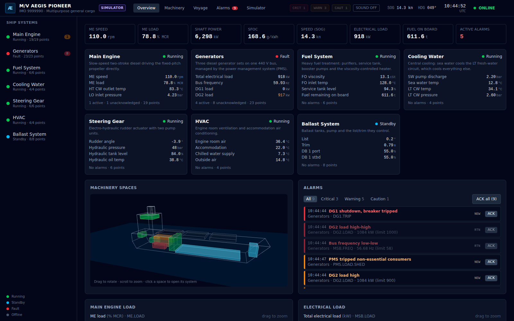
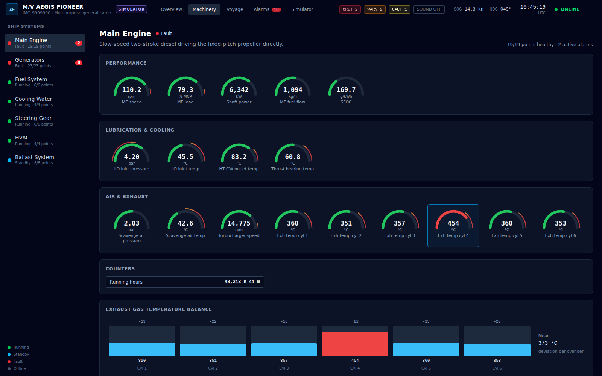
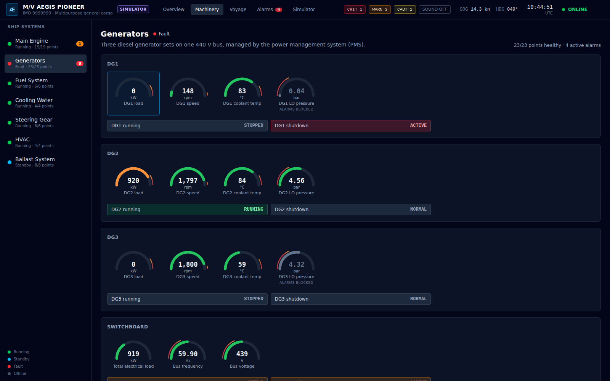
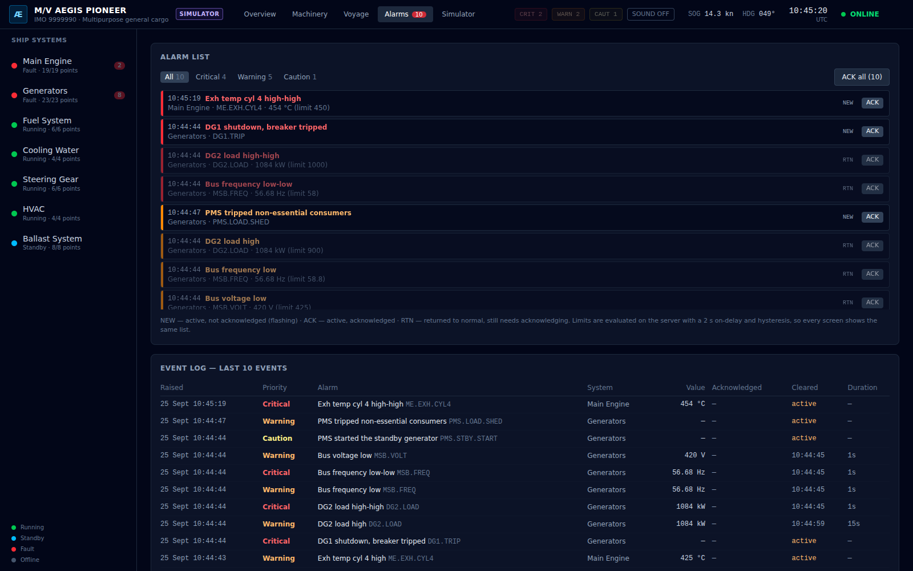
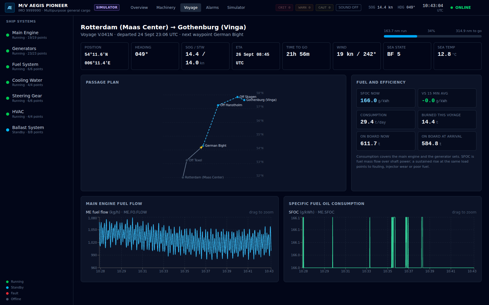
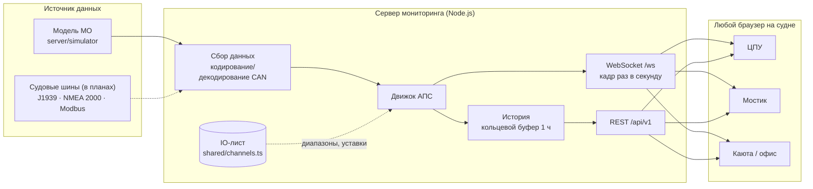

# AEGIS-MONITOR — мониторинг и АПС машинного отделения

**English version: [README.md](README.md)**



---

## Коротко: в чём суть

AEGIS-MONITOR — это веб-система мониторинга судовой энергетической установки. Она:

1. **собирает** данные с тех шин, которые на судне уже есть (J1939 от дизель-генераторов,
   NMEA 2000 от навигационных датчиков, Modbus и аналоговые 4-20 мА через ПЛК);
2. **сводит** их в единый перечень контролируемых точек — IO-лист (70 точек, 7 систем);
3. **обрабатывает тревоги** в одном месте, на сервере, по правилам нормальной АПС
   (задержка, гистерезис, блокировка, неисправность датчика, квитирование);
4. **хранит историю** и считает эффективность (SFOC, расход в сутки, остаток топлива к приходу);
5. **показывает** всё это в любом браузере на судне: в ЦПУ, на мостике, в каюте стармеха.

Пока система не подключена к реальному железу, данные даёт **физическая модель машинного
отделения** сухогруза на 28 000 т, который идёт из Роттердама в Гётеборг. Это не случайные числа:
мощность связана с оборотами винтовой характеристикой, расход — кривой удельного расхода, температуры
отстают от тепловой нагрузки, PMS запускает резервный генератор, авторулевой ведёт судно по
маршруту. В модель можно ввести восемь настоящих неисправностей — и тревоги появляются ровно так,
как появились бы на вахте.

> Это вторичная система **только для чтения**. Она не заменяет одобренную классификационным
> обществом систему АПС, которую требует СОЛАС, глава II-1. Подробнее — в разделе
> [Границы проекта](#границы-проекта-и-стандарты).

---

## Содержание

- [Зачем это нужно](#зачем-это-нужно)
- [Что система умеет](#что-система-умеет)
- [Как это устроено](#как-это-устроено)
- [Почему сделано именно так](#почему-сделано-именно-так)
- [Модель тревог (АПС)](#модель-тревог-апс)
- [Симулятор: что моделируется и зачем он нужен](#симулятор-что-моделируется-и-зачем-он-нужен)
- [Что где лежит](#что-где-лежит)
- [Как запустить](#как-запустить)
- [Как показать за пять минут](#как-показать-за-пять-минут)
- [API](#api)
- [Тесты](#тесты)
- [Что сделано в версии 0.2 и почему](#что-сделано-в-версии-02-и-почему)
- [Границы проекта и стандарты](#границы-проекта-и-стандарты)
- [Что дальше](#что-дальше)
- [Автор](#автор)

---

## Зачем это нужно

На судне информация о механизмах разбросана:

- штатная АПС в ЦПУ — надёжная и одобренная, но закрытая: данные из неё трудно достать,
  тренды короткие, анализа эффективности нет, с мостика или из каюты её не видно;
- панели PMS и главного распределительного щита — отдельно;
- дисплеи ЭБУ дизель-генераторов — отдельно, на самих генераторах;
- температура забортной воды, положение руля, курс — в навигационной сети мостика;
- расход топлива и SFOC вахтенный механик считает по журналу и калькулятору.

Картину целиком вахтенный собирает в голове. AEGIS-MONITOR — попытка собрать её на экране:
**один IO-лист, один список тревог, одна история, один экран для всех**, плюс то, чего нет в
штатной АПС: удельный расход, прогноз остатка топлива, тренды за час, 3D-схема отсеков,
доступ с любого компьютера судовой сети.

Для кого:

- **вахтенный механик** — всё машинное отделение на одном экране, понятные тревоги;
- **старший механик** — тренды, эффективность ГД, журнал событий у себя в каюте;
- **мостик** — видит состояние энергетики и тревоги без звонка в ЦПУ;
- **обучение** — симулятор с неисправностями как тренажёр: как развивается отказ и как на него
  реагирует автоматика.

---

## Что система умеет

| Функция | Что это значит |
|---|---|
| **70 точек, 7 систем** | ГД, дизель-генераторы и ГРЩ, топливоподготовка, охлаждение, рулевая машина, вентиляция и кондиционирование, балласт и остойчивость. Каждая точка описана один раз в [IO-листе](docs/io-list.md): диапазон, уставки, адрес на шине и **зачем её контролировать**. |
| **АПС на сервере** | Уставки H/HH и L/LL, задержка 2 с, гистерезис, блокировка тревог остановленных механизмов, обнаружение обрыва датчика, жизненный цикл NEW → ACK → RTN. Один список тревог на все экраны; квитирование на мостике сразу видно в ЦПУ. |
| **Настоящий путь через шины** | Данные генераторов идут кадрами SAE J1939 (EEC1, ET1, EFL/P1), руль и температуры — кадрами NMEA 2000 (127245, 130312), и декодируются теми же декодерами, что работали бы на реальной CAN-шине — с реальной дискретностью. |
| **Живой интерфейс** | Стрелочные приборы с зонами уставок, лампы состояний, тренды с линиями уставок, баланс температур выпускных газов по цилиндрам, 3D-разрез отсеков с цветом по состоянию систем, звуковая сигнализация, индикация устаревших данных. |
| **Рейс и эффективность** | Карта маршрута, ETA, SFOC, расход в сутки, топливо, сожжённое за рейс, и остаток к приходу. |
| **История** | Час данных на сервере с частотой 1 Гц, заполняется при старте — тренды полные сразу, а после обрыва связи провал дозаполняется. |
| **Ввод неисправностей** | Восемь сценариев: от засорения фильтра масла ГД до отключения генератора с отключением неответственных потребителей и пуском резервного. |

| ГД с неисправностью цилиндра 4 | Генераторы после отключения ДГ1 |
|---|---|
|  |  |
| **Тревоги и журнал событий** | **Рейс** |
|  |  |

---

## Как это устроено



### Путь одного значения

Возьмём давление масла дизель-генератора №1. Раз в секунду (`server/runtime.ts`):

1. **Модель** (`server/simulator/plant.ts`) считает физическое давление: 4,47 бар.
2. **ЭБУ генератора** (симулированный) упаковывает его в кадр J1939 PGN 65263, SPN 100:
   4,47 бар = 447 кПа → 447 / 4 кПа на бит = 112 → байт 4 кадра.
3. **Шлюз** (`server/acquisition/fieldbus.ts`) декодирует кадр тем же кодом, что работал бы на
   реальной шине (`server/protocols/j1939.ts`): 112 × 4 = 448 кПа → **4,48 бар**. Дискретность
   0,04 бар — как на настоящем двигателе.
4. Значение округляется до точности отображения — **тревога срабатывает ровно на том, что видно на
   экране**.
5. **Движок АПС** (`server/alarms.ts`) сравнивает с уставками из IO-листа: L = 3,0 бар,
   LL = 2,5 бар, но только если `DG1.RUN = 1` — у стоящего генератора нулевое давление нормально.
6. Значение ложится в **историю** (`server/history.ts`), а **кадр** со всеми значениями,
   состояниями систем, списком тревог и данными рейса уходит всем браузерам по WebSocket.
7. **Браузер** (`src/`) рисует прибор с зонами уставок, тренд и строку в IO-таблице.

Точки Modbus и 4-20 мА (давление масла ГД, температуры, уровни) идут мимо шага 2-3: в реальной
установке их отдаёт ПЛК по Modbus TCP, а здесь регистры ПЛК «играет» модель.

---

## Почему сделано именно так

| Решение | Почему |
|---|---|
| **IO-лист — это код** (`shared/channels.ts`) | Модель, декодеры, АПС, раскладка интерфейса и документация читают одну таблицу. Добавить датчик — добавить одну строку. Тесты проверяют таблицу: уникальность тегов, уставки внутри диапазона, предупредительная раньше аварийной, блокирующие теги существуют. [docs/io-list.md](docs/io-list.md) генерируется из неё же, CI не пропустит устаревшую документацию. |
| **Общие типы** (`shared/types.ts`) | Всё, что идёт по сети, описано один раз. Сервер и браузер не могут «разъехаться» в формате данных — TypeScript не соберёт проект. |
| **Тревоги на сервере, а не в браузере** | На судне несколько экранов. Если каждый считает тревоги сам, у каждого свой список, квитирование на мостике не видно в ЦПУ, а перезагрузка страницы теряет тревоги. Сервер — единственный источник правды. |
| **Задержка, гистерезис, блокировка, неисправность датчика** | Без этого АПС «дребезжит» и сыплет ложными тревогами. Вахтенный привыкает их квитировать не глядя — и пропускает настоящую. Борьба с ложными тревогами — это вопрос безопасности, а не удобства. |
| **WebSocket для живых данных, REST для остального** | Кадр раз в секунду удобно раздавать всем подписчикам сразу; история, журнал, квитирование и управление симулятором — это запросы по требованию. |
| **Один источник на все окна** | Раньше каждое подключение получало свои случайные числа. Теперь один тик модели раздаётся всем — два экрана показывают одно и то же. |
| **Интерфейс ходит только на свой адрес** | Браузер обращается к `/api` и `/ws` на том же хосте, а Vite (при разработке) и nginx (в Docker) проксируют их на сервер. Система работает под любым IP и именем в судовой сети без настройки. |
| **Физическая модель вместо случайных чисел** | На случайных числах нельзя проверить ни АПС, ни интерфейс: не бывает ни развития отказа, ни взаимосвязей (перегрузка → провал частоты → разгрузка → пуск резервного). На модели можно. |
| **Воспроизводимость** (`SIM_SEED`) | Одинаковое зерно — одинаковый прогон. Тесты детерминированы, демо повторяемо, ошибку можно воспроизвести. |
| **Только чтение** | Система никогда ничего не пишет в шины и контроллеры. Вторичный мониторинг не должен иметь возможности вмешаться в управление. |

---

## Модель тревог (АПС)

Каждая уставка каждой точки — отдельная **точка тревоги**: `ME.LO.PRESS:warning` (L),
`ME.LO.PRESS:critical` (LL), `DG1.TRIP:state`, `SW.PRESS:fault`.

| Правило | Как работает |
|---|---|
| Задержка срабатывания | Условие должно держаться 2 с — кратковременный выброс не даёт тревоги. |
| Гистерезис | Тревога снимается, только когда значение ушло от уставки на 1% шкалы — значение, «сидящее» на уставке, не дребезжит. |
| Блокировка | У точек с `inhibitedBy` тревоги не работают, пока механизм остановлен (нулевое давление масла у резервного ДГ — это норма). |
| Неисправность датчика | Значение дальше 10% шкалы за пределами диапазона прибора (обрыв петли 4-20 мА даёт −25%) — это *Caution* «неисправность датчика», а технологические тревоги этой точки подавляются. Ложная авария «низкое давление» не появляется. |
| Жизненный цикл | **NEW** — активна, не квитирована, мигает → **ACK** — активна, квитирована, горит ровно → исчезает, когда условие ушло. Если условие ушло раньше квитирования — остаётся как **RTN** (вернулась в норму) до квитирования. |
| Приоритеты | Critical ≈ «alarm» по IEC 62923, Warning ≈ «warning», Caution ≈ «caution». Цвета — красный / оранжевый / жёлтый. |

Состояние системы в боковой панели: **Fault**, если в ней активна хотя бы одна Critical;
**Standby**, если механизм системы остановлен (балластный насос в море стоит); иначе **Running**.

---

## Симулятор: что моделируется и зачем он нужен

**Зачем.** Доступа к судовому железу у разработки нет, а проверять АПС и интерфейс на
случайных числах бессмысленно. Модель позволяет разрабатывать, тестировать, обучать и показывать
систему так, будто она стоит на судне.

**Что внутри** (`server/simulator/plant.ts`) — связанные модели первого порядка с шагом 1 с:

- **ГД**: 6 цилиндров, двухтактный, MCR 8000 кВт при 120 об/мин, морской ход на 78% MCR.
  Обороты по винтовой характеристике; волнение меняет момент на винте — регулятор держит
  обороты, двигается топливная рейка. Кривая SFOC с минимумом около 78% нагрузки. Тепловая инерция
  охлаждающей воды, масла, продувочного воздуха, упорного подшипника и выпускных газов каждого
  цилиндра со своими постоянными отклонениями.
- **Электростанция**: 3 ДГ по 1000 кВт, нагрузка около 1060 кВт с медленным блужданием и
  циклически работающим компрессором. PMS: пуск резервного при отключении генератора или загрузке
  выше 90%, отключение неответственных потребителей после 4 с перегрузки, обратное подключение,
  когда появляется запас; провал частоты при набросе нагрузки.
- **Топливо**: подогреватель с регулированием по вязкости, расходная цистерна, сожжённое топливо
  и остаток.
- **Навигация**: маршрут по локсодромии, ПИД-авторулевой с моделью рыскания Номото, ветер
  и волна, скорость по шагу винта и скольжению, приливное течение.
- **Балласт**: уровни в танках, крен от поперечного момента, качка.

Без неисправностей модель часами работает **без единой тревоги** — это проверяет тест
(час хода на трёх разных зёрнах).

**Неисправности** (вкладка *Simulator*):

| Сценарий | Что должно произойти |
|---|---|
| Засорение фильтра масла ГД | Давление масла L через ~70 с, LL через ~110 с |
| Заклинил термостат ВТ-контура | Температура ВТ на выходе H через ~110 с, HH через ~160 с |
| Неисправность форсунки цилиндра 4 | Выпускные газы цил. 4 H / HH, SFOC растёт |
| Отключение генератора | Срабатывание защиты, перегрузка, провал частоты, отключение неответственных, пуск резервного |
| Отказ подогревателя топлива | Вязкость H через ~70 с, HH через ~130 с |
| Утечка гидравлики рулевой машины | Уровень в цистерне L / LL (СОЛАС II-1/29) |
| Пропускает клапан балласта | Танк DB 1 стбд заполняется, крен больше 5° |
| Обрыв датчика давления забортной воды | Caution «неисправность датчика», ложной аварии нет |

---

## Что где лежит

```
shared/                       Общий код сервера и интерфейса
  types.ts                    Всё, что ходит по сети: кадр, тревога, рейс, состояние систем
  channels.ts                 IO-лист: 70 точек — диапазоны, уставки, адреса, описания
  vessel.ts                   Данные демонстрационного судна (судно вымышленное)
server/                       Сервер мониторинга
  index.ts                    Точка входа: тик раз в секунду, рассылка по WebSocket, остановка
  runtime.ts                  Один тик: модель → шины → АПС → история → кадр
  api.ts                      REST-маршруты
  alarms.ts                   Движок АПС
  history.ts                  Кольцевой буфер истории в памяти
  acquisition/fieldbus.ts     Кодирование/декодирование кадров J1939 и NMEA 2000 в теги
  protocols/j1939.ts          Кодек SAE J1939 (EEC1, ET1, EFL/P1)
  protocols/nmea2000.ts       Кодек NMEA 2000 (127245, 127488, 130312)
  simulator/plant.ts          Физика машинного отделения
  simulator/scenarios.ts      Сценарии неисправностей
  simulator/route.ts          Маршрут и плоское счисление
  simulator/random.ts         Воспроизводимый шум, инерционные звенья, случайное блуждание
  **/*.test.ts                Тесты лежат рядом с тем, что проверяют
src/                          Интерфейс (React 19, Vite, Tailwind 4)
  App.tsx                     Каркас и переключение вкладок
  config.ts                   Адреса и временные константы
  api/client.ts               Типизированный REST-клиент
  hooks/                      WebSocket, подключение телеметрии, квитирование, звук, часы
  store/useVesselStore.ts     Хранилище (Zustand): кадр, история, тревоги, навигация
  views/                      Экраны: Overview, Machinery, Voyage, Alarms, Simulator
  components/                 Прибор, тренд, список тревог, 3D-разрез, шапка, боковая панель
  utils/                      Форматирование, окраска по уставкам
scripts/gen-io-list.ts        Генерирует docs/io-list.md из shared/channels.ts
deploy/nginx.conf             Раздаёт интерфейс, проксирует /api и /ws на сервер
docs/                         IO-лист и скриншоты
Dockerfile, Dockerfile.server Образы интерфейса (nginx) и сервера (Node 22)
docker-compose*.yml           Локальный и «боевой» запуск в Docker
.github/workflows/ci.yml      CI: линтер, тесты, сборка, актуальность IO-листа
```

### Экраны интерфейса

| Вкладка | Что на ней |
|---|---|
| **Overview** | Ключевые цифры (обороты, нагрузка, мощность, SFOC, скорость, электронагрузка, топливо, тревоги), карточка каждой системы, 3D-разрез отсеков, список тревог, тренды. |
| **Machinery** | Все точки выбранной системы: приборы с зонами уставок, лампы, счётчики, тренд выбранной точки с линиями уставок, баланс выпускных газов ГД, IO-таблица с адресами на шине. |
| **Voyage** | Карта маршрута, позиция, курс, скорость, ETA, SFOC, расход в сутки, топливо за рейс и остаток к приходу, погода. |
| **Alarms** | Список тревог по приоритету с квитированием, журнал событий с длительностью. |
| **Simulator** | Ввод и снятие неисправностей, сброс. |

---

## Как запустить

Нужно: Node.js 22+, npm 10+.

```bash
git clone https://github.com/hermandoronin/AEGIS-MONITOR.git
cd AEGIS-MONITOR
npm install
npm start        # сервер на :3001 и интерфейс на :5173
```

Открыть **http://localhost:5173**.

| Команда | Что делает |
|---|---|
| `npm start` | Сервер и интерфейс вместе |
| `npm run server` / `npm run dev` | По отдельности |
| `npm test` | Тесты |
| `npm run build` | Проверка типов и сборка интерфейса в `dist/` |
| `npm run lint` | Линтер |
| `npm run docs:io-list` | Перегенерировать [docs/io-list.md](docs/io-list.md) |

Настройки сервера (все необязательные, см. [.env.example](.env.example)): `PORT`, `SIM_SEED`
(фиксированное зерно — повторяемый прогон), `BACKFILL_S` (сколько истории генерировать при старте),
`TICK_MS` (период опроса).

В Docker:

```bash
docker compose up --build                                  # http://localhost:8080
docker compose -f docker-compose.prod.yml up -d --build    # порт 80, автоперезапуск
```

---

## Как показать за пять минут

1. **Overview** — всё зелёное, судно на ходу, сверху ключевые цифры.
2. **Simulator → Generator shutdown → Inject**, открыть *Generators*. ДГ1 отключается, ДГ2
   перегружен до ~110%, частота проваливается ниже 58 Гц; через 4 с PMS отключает неответственных
   потребителей, через 18 с ДГ3 на шинах и принимает нагрузку, ещё через 30 с потребители
   возвращаются.
3. **Alarms** — вся цепочка видна: тревоги по частоте и перегрузке уже вернулись в норму (RTN),
   но ждут квитирования; в журнале видно, сколько длилась каждая.
4. **Simulator → Cylinder 4 injector fault**, открыть *Main Engine*: на балансе выпускных газов
   цилиндр 4 уходит от среднего, затем H и HH; на вкладке *Voyage* растёт SFOC.
5. **Sea water pressure transmitter wire break** — приходит Caution «неисправность датчика», а не
   ложная авария по давлению.
6. **Reset all faults**.

---

## API

Базовый путь `/api/v1`, идентификатор демо-судна `aegis-001`.

| Метод | Путь | Что возвращает |
|---|---|---|
| GET | `/health` | Состояние, аптайм, время последнего кадра |
| GET | `/vessels` | Суда на этом сервере |
| GET | `/vessels/:id` | Данные судна |
| GET | `/vessels/:id/channels` | IO-лист |
| GET | `/vessels/:id/status` | Последний кадр |
| GET | `/vessels/:id/history?seconds=900&tags=A,B` | `{ tags, rows: [[t, v1, v2…]] }`, до 3600 с |
| GET | `/vessels/:id/alarms?limit=200` | Журнал тревог, новые сверху |
| POST | `/vessels/:id/alarms/:alarmId/ack` | Квитировать одну |
| POST | `/vessels/:id/alarms/ack-all` | Квитировать все |
| GET | `/sim/scenarios` | Сценарии неисправностей и их состояние |
| POST | `/sim/scenarios/:id/start` · `/stop` | Ввести / снять неисправность |
| POST | `/sim/reset` | Снять все, вернуть механизмы в норму |

**WebSocket** `/ws`: при подключении — последний кадр, затем по кадру каждую секунду. Все типы — в
[`shared/types.ts`](shared/types.ts).

---

## Тесты

```bash
npm test
```

58 тестов: кодеки J1939 и NMEA 2000 (кадры, собранные вручную по спецификации, кодирование туда и
обратно, значения «нет данных», адресация PDU1), путь через шины, каждое правило АПС, буфер
истории, целостность IO-листа, REST API от ввода неисправности до квитирования и модель: час хода
без тревог на трёх зёрнах, воспроизводимость, каждый сценарий даёт свои тревоги. CI гоняет линтер,
тесты, проверку типов и сборку на каждый push и pull request.

---

## Что сделано в версии 0.2 и почему

Версия 0.1 была прототипом интерфейса. Вот что в ней было не так и что с этим сделано.

| Было | Стало | Зачем |
|---|---|---|
| Сервер генерировал `Math.random()`, и **каждое подключение — свои числа** | Одна физическая модель МО, один тик раздаётся всем | Два экрана должны показывать одно и то же; на случайных числах нельзя проверить АПС |
| 6 параметров ГД; **6 из 7 систем в боковой панели — Offline без данных** | 70 точек во всех 7 системах, IO-лист с адресами и описаниями | Система мониторинга машинного отделения, а не одного двигателя |
| **Тревоги считались в браузере**: у каждого окна свои, терялись при перезагрузке, без задержки и гистерезиса | Движок АПС на сервере: L/LL, H/HH, задержка, гистерезис, блокировка, неисправность датчика, NEW/ACK/RTN | Единый список тревог, квитирование видно везде, нет дребезга и ложных тревог |
| Декодеры J1939/NMEA 2000 **лежали мёртвым кодом**; в PGN 130312 **поля были сдвинуты на байт**; PGN для PDU1-сообщений извлекался неверно | Декодеры в реальном пути данных, ошибки исправлены, добавлены кодировщики, PGN 127245 (руль), обработка «нет данных» | Когда появится CAN-шлюз, менять придётся только источник кадров |
| REST-клиент был написан, но **не вызывался** | История, журнал тревог, квитирование, управление симулятором — через REST | Каждая часть кода делает работу |
| В `docker-compose.prod.yml` **браузер не мог достучаться до WebSocket** (порт не опубликован, nginx не проксировал) | nginx проксирует `/api` и `/ws`, интерфейс ходит на свой адрес | Развёртывание в Docker действительно работает |
| Контейнер TimescaleDB и зависимости `pg`/`dotenv` — **ничем не использовались** | Убраны; хранение в БД — в планах | Ничего лишнего и непонятного в поставке |
| WebSocket **переставал переподключаться после 10 попыток**; в StrictMode создавались лишние соединения | Бесконечные попытки с нарастающей паузой, корректная очистка; баннер «связь потеряна», дозаполнение истории | Экран в ЦПУ не должен «умереть» после перезагрузки сервера |
| 3D-модель — **четыре вращающихся куба** | Разрез судна с отсеками, окрашенными по состоянию систем, клик открывает систему | 3D должно что-то сообщать |
| Тестов **не было** | 58 тестов, CI гоняет их на каждый push | Изменения можно делать без страха |
| Бандл **1,5 МБ одним файлом** | Three.js, графики и React в отдельных кэшируемых чанках | Быстрее загрузка на медленной судовой сети |
| SFOC считался в браузере, суммы расхода — «с момента открытия страницы» | SFOC — расчётный канал на сервере за минутное окно; расход — с начала рейса | Цифры имеют смысл для механика |

---

## Границы проекта и стандарты

Это личный проект действующего судового механика. Ни с чем соответствие не заявляется.
Что повлияло на решения:

- **IEC 62923-1/-2** (управление тревогами на мостике) — приоритеты, модель квитирования и
  «вернулась в норму, не квитирована». Сделано: три приоритета, состояния NEW/ACK/RTN.
  Не сделано: эскалация, заглушение, передача ответственности, отложенные тревоги.
- **IMO MSC.1/Circ.1512** и **IEC 62288** — контрастный интерфейс под освещение ЦПУ и мостика,
  единая цветовая схема состояний.
- **СОЛАС II-1/29** — тревога по низкому уровню гидравлики рулевой машины (моделируется).
- **SAE J1939-71** и **NMEA 2000** — масштабирование и расположение полей декодируемых PGN.

Система **только читает** данные и никогда ничего не пишет в шины и контроллеры. Основной системой
на борту остаётся одобренная классом АПС.

---

## Что дальше

- **Реальный сбор данных**: шлюз SocketCAN для уже готовых декодеров J1939/NMEA 2000, клиент
  Modbus TCP для регистров ПЛК и PMS. Меняется только функция `acquire()`.
- **Хранение**: TimescaleDB для долгой истории и журнала тревог.
- **Права доступа**: мостик и берег — только просмотр, квитирование — механики.
- **Больше IEC 62923**: заглушение, отложенные тревоги, эскалация, группы.
- **Диагностика J1939**: активные коды неисправностей DM1 (SPN/FMI).
- **Отчёты**: полуденный рапорт, данные по топливу для IMO DCS / EU MRV, CII.
- **Флот**: несколько судов на одном береговом сервере.

---

## Автор

Судовой механик — от генгрузов до круизных лайнеров. Учусь программировать, делая инструменты,
которых мне не хватало на вахте. Разрыв между «сырыми» данными механизмов и понятной картиной
очевиден из машинного отделения; этот репозиторий — попытка его закрыть.

## Лицензия

MIT, см. [LICENSE](LICENSE).
